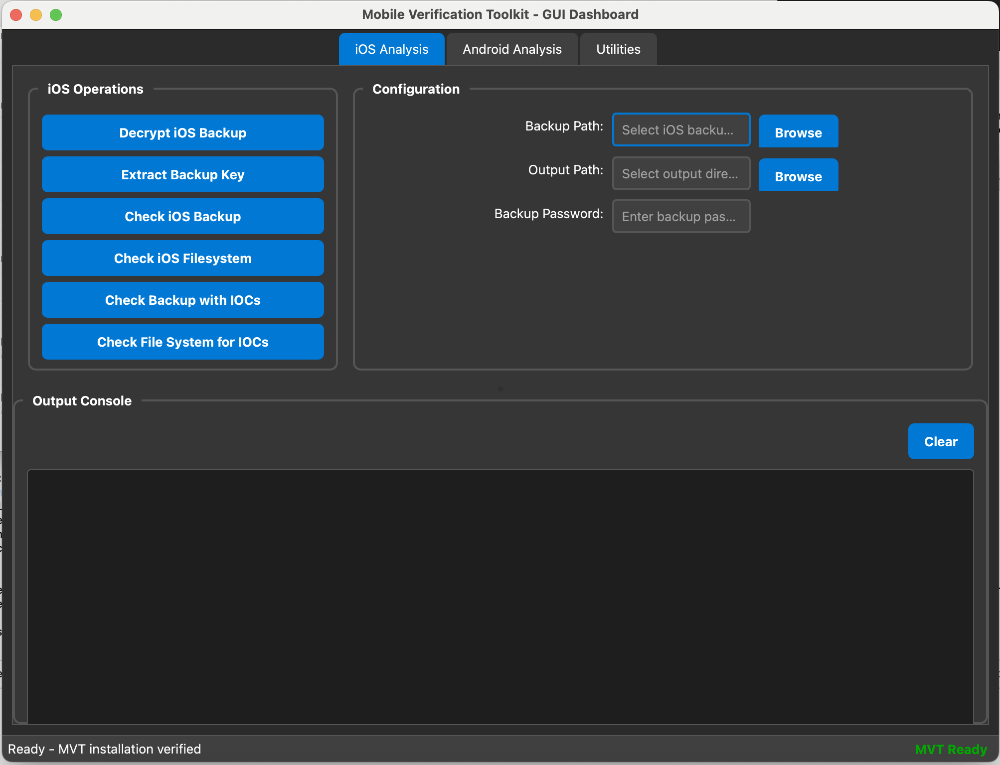

# MVT-Dashboard

A graphical user interface for the [Mobile Verification Toolkit (MVT)](https://github.com/mvt-project/mvt), which helps with conducting forensics of mobile devices to detect potential compromise.

## Overview

This GUI provides a user-friendly interface to MVT's command-line tools, making it easier to perform mobile device forensic analysis without having to remember complex command-line arguments.



## Features

### iOS Analysis
- **Decrypt iOS Backup** - Decrypt an encrypted iOS backup using the provided password
- **Extract Backup Key** - Extract encryption key from iOS backup
- **Check iOS Backup** - Analyze iOS backup for potential indicators of compromise
- **Check iOS Filesystem** - Analyze iOS filesystem dump for potential threats
- **Check Backup with IOCs** - Run full backup analysis with IOC checking enabled
- **Check File System for IOCs** - Analyze iOS filesystem dump for IOCs and potential threats

### Android Analysis
- **Download APKs** - Download APK files from connected Android device
- **Check Device via ADB** - Check connected Android device via ADB for potential threats
- **Check Bugreport** - Analyze Android bugreport for indicators of compromise
- **Check Android Backup** - Analyze Android backup for potential threats
- **Check AndroidQF** - Analyze Android Quick Forensics data
- **Check Backup with IOCs** - Run full backup analysis with IOC checking using default IOC path

### Utilities
- **Download/Update IOCs** - Download latest Indicators of Compromise definitions for both iOS and Android
- **Display MVT Version** - Show installed MVT version information for both iOS and Android
- **Update MVT** - Update Mobile Verification Toolkit to the latest version

## Requirements

- Python 3.6 or newer
- Mobile Verification Toolkit (MVT)
- PyQt5

## Installation

1. First, ensure MVT is installed:
   ```bash
   pip3 install mvt
   ```

2. Install PyQt5:
   ```bash
   pip3 install PyQt5
   ```
   
   Or install all dependencies at once:
   ```bash
   pip3 install -r requirements.txt
   ```

3. Download the MVT-Dashboard:
   ```bash
   git clone https://github.com/yourusername/mvt-dashboard.git
   cd mvt-dashboard
   ```

4. Run the application:
   ```bash
   python3 run_mvt_gui.py
   ```

## Usage

### Getting Started

1. Launch the application using `python3 run_mvt_gui.py`
2. The application will automatically check if MVT is properly installed
3. Select the appropriate tab based on your device type (iOS/Android) or utility needs

### iOS Analysis

1. **Basic iOS Backup Analysis**:
   - Select the **iOS Analysis** tab
   - Browse and select your iOS backup directory in "Backup Path"
   - Choose an output directory for results
   - Click "Check iOS Backup" to analyze for potential threats

2. **Decrypt iOS Backup**:
   - Enter the backup path and destination output path
   - Provide the backup password if the backup is encrypted
   - Click "Decrypt iOS Backup"

3. **IOC Analysis**:
   - Use "Check Backup with IOCs" or "Check File System for IOCs" for enhanced threat detection
   - The application automatically uses the default IOC database location

### Android Analysis

1. **Connect to Device via ADB**:
   - Ensure USB debugging is enabled on your Android device
   - Connect your device via USB
   - Enter device serial (optional) if multiple devices are connected
   - Click "Check Device via ADB"

2. **Download APKs**:
   - Set an output path for downloaded APK files
   - Choose whether to download all APKs (including system apps)
   - Click "Download APKs"

3. **Analyze Android Data**:
   - Use "Check Bugreport" for analyzing Android bug reports
   - Use "Check Android Backup" for analyzing Android backup files
   - Use "Check AndroidQF" for Android Quick Forensics data analysis

### Utilities

1. **Keep IOCs Updated**:
   - Click "Download/Update IOCs" to get the latest threat indicators
   - This downloads IOC databases for both iOS and Android platforms

2. **Check MVT Version**:
   - Click "Display MVT Version" to see your current MVT installation details

3. **Update MVT**:
   - Click "Update MVT" to upgrade to the latest version of the Mobile Verification Toolkit
   - The application may need to be restarted after updating

### Viewing Results

- All command output is displayed in real-time in the console area
- Results are color-coded for easy reading (green for success, red for errors, etc.)
- Detailed analysis results are saved to your selected output directory
- Use the "Clear" button to clear the console output when needed

## Key Features

- **Real-time Console Output**: See command progress and results as they happen
- **Dark Theme Interface**: Modern, easy-on-the-eyes design
- **Progress Indicators**: Visual feedback during long-running operations
- **Input Validation**: Prevents common user errors with helpful warnings
- **Multi-platform Support**: Works with both iOS and Android devices
- **Automatic IOC Integration**: Seamlessly uses MVT's IOC databases for threat detection

## File Structure

```
mvt-dashboard/
├── run_mvt_gui.py         # Application launcher
├── mvt_gui.py             # Main GUI application
├── requirements.txt       # Python dependencies
├── README.md              # This file
├── CLAUDE.md              # Development reference
├── _img/                  # Screenshots and images
│   └── MVT-dashboard.png  # Application screenshot
└── CHANGELOG.md           # Version history
```

## Troubleshooting

### Common Issues

- **MVT Not Found**: Ensure MVT is installed and in your PATH. Try `mvt-ios version` in terminal to verify.
- **ADB Connection Issues**: 
  - Verify USB debugging is enabled on your Android device
  - Check that your device appears in `adb devices`
  - Try different USB cables or ports
- **Permission Errors**: Make sure you have read/write permissions to the selected directories
- **PyQt5 Installation Issues**: 
  - On macOS: Try `pip3 install --user PyQt5`
  - On Linux: You may need to install additional system packages

### Getting Help

If you encounter issues:
1. Check the console output for detailed error messages
2. Verify all requirements are properly installed
3. Ensure your device is properly connected (for ADB operations)
4. Try running the equivalent MVT command-line tool directly to isolate GUI vs MVT issues

## Dependencies

The application requires these Python packages (see `requirements.txt`):

- `mvt>=2.5.0` - Mobile Verification Toolkit
- `PyQt5>=5.15.4` - GUI framework

## License

This project is governed by the same license as MVT (MVT License 1.1).

## Credits

This GUI was created to simplify the use of the [Mobile Verification Toolkit](https://github.com/mvt-project/mvt) by Amnesty International Security Lab.

## Contributing

Contributions are welcome! Please feel free to submit issues, feature requests, or pull requests to help improve MVT-Dashboard.